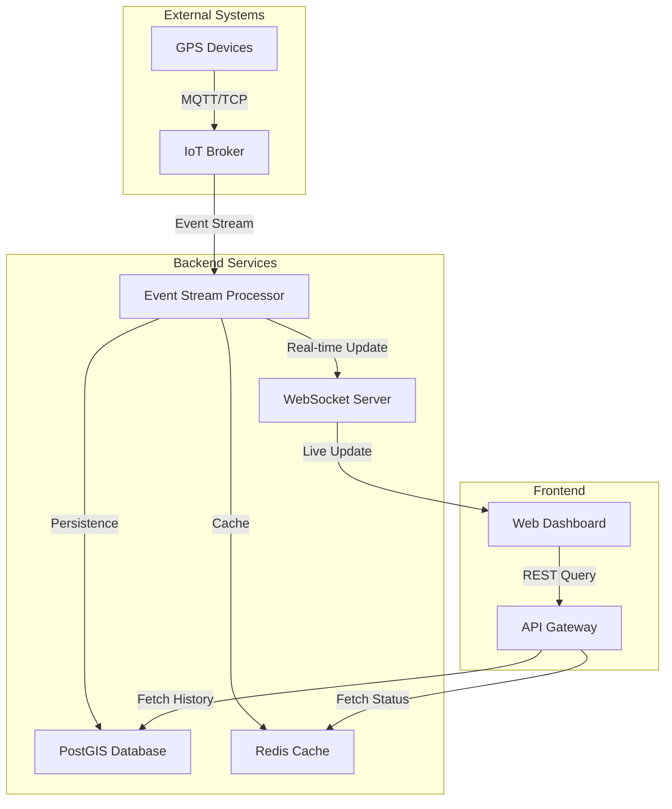

# Tracking Module: Technical Architecture

This document outlines the architecture for the enterprise-grade Tracking Module.

## 1. Real-Time Architecture Diagram



## 2. API Design (REST)

### Live Overview
`GET /api/tracking/live`
**Response:**
```json
{
  "totalVehicles": 1500,
  "statusSummary": { "moving": 800, "idle": 400, "offline": 300 },
  "vehicles": [
    {
      "id": "v-101",
      "lat": 24.7136, "lng": 46.6753,
      "speed": 85, "heading": 120,
      "status": "moving", "ignition": true
    }
  ]
}
```

### Vehicle History
`GET /api/tracking/vehicle/{id}/history?start={ISO}&end={ISO}`
**Response:**
```json
{
  "vehicleId": "v-101",
  "summary": { "distance": 145.2, "avgSpeed": 62, "maxSpeed": 110 },
  "segments": [
    {
      "type": "driving",
      "points": [{ "lat": 24.71, "lng": 46.67, "t": "2026-03-09T10:00Z", "s": 65 }]
    }
  ]
}
```

## 3. WebSocket Message Format
**Topic:** `tracking.live.{tenantId}`
**Payload:**
```json
{
  "event": "position_update",
  "data": {
    "vehicleId": "v-101",
    "lat": 24.7145,
    "lng": 46.6762,
    "speed": 88,
    "heading": 125,
    "timestamp": "2026-03-09T17:20:05Z",
    "telemetry": {
      "fuel": 78,
      "odometer": 15430.5,
      "ignition": true
    }
  }
}
```

## 4. Security & Isolation
- **Tenant Isolation**: Every query is filtered by `tenant_id` at the database level (RLS).
- **Signed Links**: Shared tracking links use HMAC-signed tokens with short expiry (e.g., 2 hours).
- **Audit Logging**: Every access to `/api/tracking` is logged with user ID, timestamp, and target vehicles.
